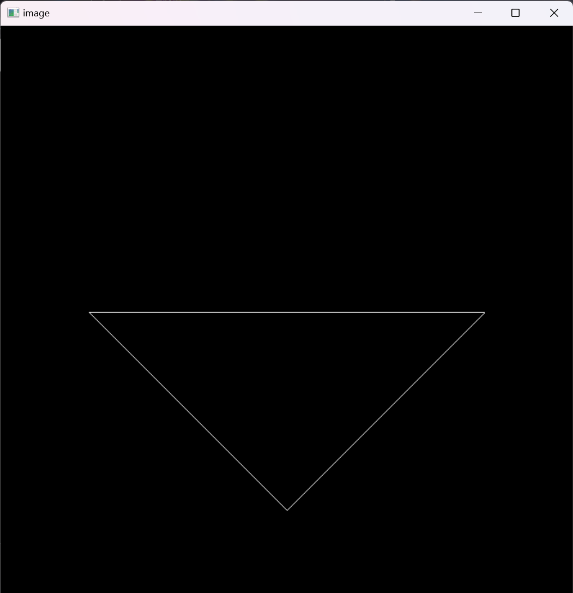
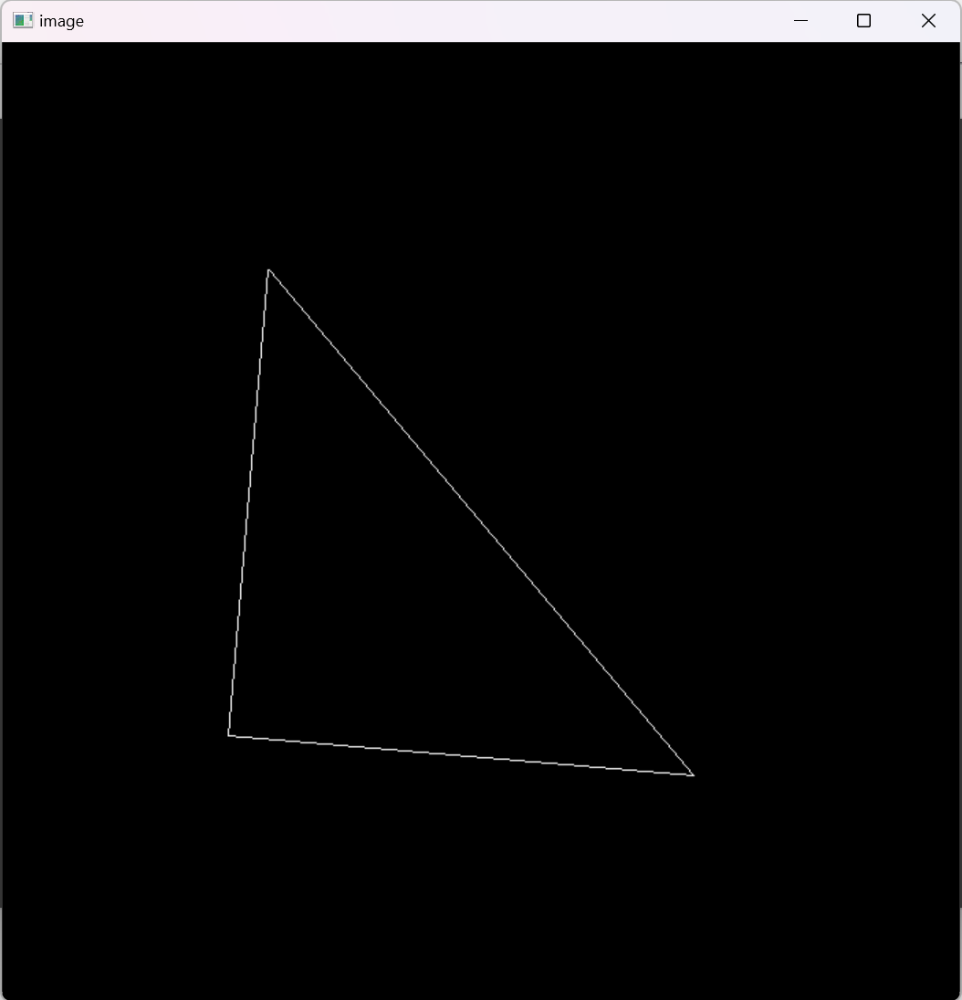
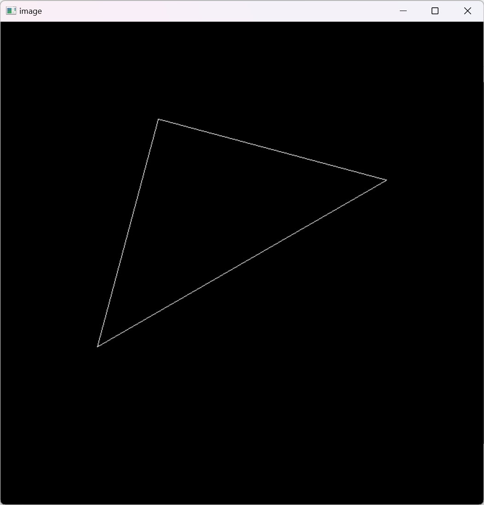
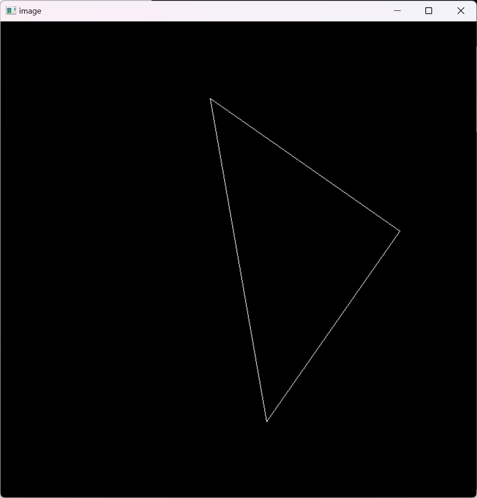

# 实验报告

## 完成情况

完成基本内容以及提高项

**旋转矩阵**

```c++
Eigen::Matrix4f get_model_matrix(float rotation_angle)
{
    Eigen::Matrix4f model = Eigen::Matrix4f::Identity();

    // TODO: Implement this function
    // Create the model matrix for rotating the triangle around the Z axis.
    // Then return it.
    float R_A = rotation_angle / 180.0f * MY_PI;//角度转化为弧度
    model << cos(R_A), -sin(R_A), 0, 0,
        sin(R_A), cos(R_A), 0, 0,
        0, 0, 1, 0,
        0, 0, 0, 1;//旋转矩阵
    return model;
}
```


**投影矩阵**

```c++
Eigen::Matrix4f get_projection_matrix(float eye_fov, float aspect_ratio,
                                      float zNear, float zFar)
{
    // Students will implement this function

    Eigen::Matrix4f projection = Eigen::Matrix4f::Identity();

    // TODO: Implement this function
    // Create the projection matrix for the given parameters.
    // Then return it.
    eye_fov = eye_fov / 180.0f * MY_PI;//转化为弧度

    projection << 1 / (aspect_ratio * tan(eye_fov / 2.0f)), 0, 0, 0,
        0, 1 / tan(eye_fov / 2.0f), 0, 0,
        0, 0, (zNear + zFar) / (zNear - zFar), -2.0f * zNear * zFar / (zNear - zFar),
        0, 0, 1, 0;         //使用视场角和宽高比来构造的投影矩阵
    return projection;
}
```


**绕任意过原点的轴旋转**

```c++
//绕任意过原点的轴旋转
Eigen::Matrix4f get_rotation(Vector3f axis, float angle)
{
    Eigen::Matrix4f rotation = Eigen::Matrix4f::Identity();//初始化矩阵
    angle = angle / 180.0f * MY_PI;
    Eigen::Matrix3f I = Eigen::Matrix3f::Identity(); //I
    Eigen::Matrix3f n = axis * axis.transpose();     //n*n的转置
    Eigen::Matrix3f N = Eigen::Matrix3f::Identity(); //N
    N << 0, -axis[2], axis[1],
        axis[2], 0, -axis[2],
        -axis[1], axis[0], 0;
    Eigen::Matrix3f R = cos(angle) * I + (1 - cos(angle)) * n + sin(angle) * N;
    rotation << R(0, 0), R(0, 1), R(0, 2), 0,
        R(1, 0), R(1, 1), R(1, 2), 0,
        R(2, 0), R(2, 1), R(2, 2), 0,
        0, 0, 0, 0;
    return rotation;
    
}
```

## 实验结果

### 变换后的三角形



### 三角形旋转









## 结果分析

首先可以看到屏幕输出了一个通过变换而得来的一个三角形。

然后通过键盘输入a 和 d 来控制三角形向左旋转十度还是向右旋转十度。